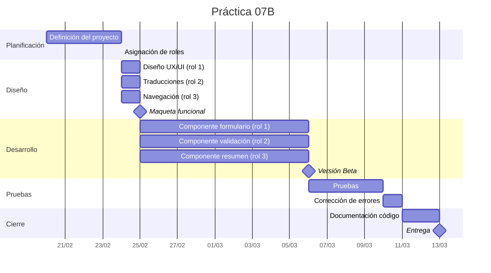

# Práctica 07B - Formulario con REACT - Entrega 13/3/2025

**React**: Librería JS enfocada a desarrollar interfaces web. Permite crear complejas UIs utilizando "componentes".
  
1. Aquí tienes un **protocolo paso a paso** para empezar a trabajar con **React** en **Visual Studio Code (VS Code)**:
    [Instalación de React-TypeScript+Vite](instalacionREACT-VITE-TYPESCRIPT.MD)

2. Conceptos básicos de REACT:
    [ConceptosBasicosReact](ConceptosBasicosReact.md)

## Índice

[Descripción de la práctica](#descripción-de-la-práctica)

- [Estructura de la aplicación](estructura-de-la-aplicación)
- [Navegación](#navegación)
- [Diseño](#diseño)
- [Multi-idioma](#multi-idioma)

[Cuestionarios JSON](#cuestionarios-json)

[Plan de trabajo](#plan-de-trabajo)

[Roles](#roles)

[Calendario-Diagrama de Gantt](#calendario-diagrama-de-gantt)

[Evaluación](#evaluación))

## Descripción de la práctica

- Crear una aplicación en React donde el usuario debe completar una serie de formularios de forma secuencial.
- La aplicación tiene múltiples formularios, y el usuario debe responder uno tras otro.
- Al finalizar se deberá poder ver los contestaciones a los 3 cuestionarios

### **Estructura de la aplicación**

1. **Múltiples Formularios**
   - La aplicación tiene 4  formularios:
     1. **Formulario de información personal**
     2. **Formulario de evaluación académica**
     3. **Formulario de preferencias en tecnología**
     4. **Formulario de preferencias en cine**

2. **Condición de Ciclo de Vida**:
   - El usuario solo puede avanzar al siguiente formulario si todos los campos del formulario actual están completos.
   - El avance de un formulario al siguiente está controlado por el estado del componente y se gestionará mediante el hook **`useState`**.
   - Después de completar un formulario, el componente desencadenará una acción para pasar al siguiente formulario.

3. **Uso de `useEffect`**:
   - **`useEffect`** puede utilizarse para manejar efectos secundarios, como la validación de formularios y la transición de un formulario al siguiente. Por ejemplo, cuando el estado de un formulario cambia (cuando se completan los campos), un efecto puede activar el paso al siguiente formulario.

4. **Control de la Secuencia**:
   - El ciclo de vida de cada formulario incluye pasos para:
     - Mostrar el formulario.
     - Validar las respuestas.
     - Pasar al siguiente formulario (sólo si es válido).

Este escenario implica:

- En el inicio debe existir una "página" de bienvenida.
- Cada formulario es una etapa dentro del ciclo de vida de la aplicación, con validaciones, transiciones y actualizaciones del estado, utilizando **`useState`** y **`useEffect`**.
- El ciclo de vida de los formularios incluye pasar del uno al siguiente solo si el formulario actual es válido.
- Guardaremos toda la información de los formularios en `localStorage` de forma que si salimos antes de terminar nos recupere la información existente.
- Si un usuario finaliza todos los cuestionarios se podrá consultar sus resultados en la última página.
- Debe existir un botón de RESET para poder empezar de nuevo.

### **Navegación**

Se basará en el estado, existiendo 3 "páginas"

- Bienvenida: donde se explicará de forma simple el objetivo de la aplicación y se indicarán las instrucciones necesarias para realizarla
- Realización de formularios: Se deberán realizar los cuestionarios de forma consecutiva validando cada form/control de forma síncrona e informando de los problemas detectados. Al finalizar el cuestionario y antes de pasar al siguiente se deberá realizar una validación general. En el final se enviará a la página resumen
- Resumen: página donde aparecerá toda la información resultante del uso de los cuestionarios.

### **Diseño**

Se realizará un diseño para la aplicación, este deberá incluir

- Seleccionar dos tipografías diferentes y aplicarlas con criterio para:
  - Titulos
  - Párrafos
  - Etiquetas de los forms
  - Contenido de los forms
  - Botones
  - Avisos
- Colores
  - Fondo página
  - Fondo cuestionarios
- Semantica
  - Section Header
    - Título de la aplicación común a todas las "paginas" y botones para cambio de idioma
  - Section contenido header
    - Banners: baner rotatorio para todos las paginas.
  - Section contenido
    - Bienvenida: texto + imagen
    - Formulario: formulario + aviso errores general
  - Section Footer
    - Nombre de la aplicacion y fecha incluyendo hora y minuto

### **Multi-idioma**

La aplicación deberá estar en español e inglés utilizando la libreria i18

## Códigos ejemplo

Encontrarás codigos ejemplo para el componente formulario y para localstorage en [Ejemplos Codigo](EjemplosCodigoPractica.md)

## Cuestionarios JSON

Los cuestionario y sus validaciones estan definidas en [cuestionarios y validaciones](cuestionariosFuente.md)


## Plan de trabajo

```plaintext
1. INICIO
   - Desarrollar una aplicación con múltiples formularios que se completan uno tras otro.
   - Desarolla una navegación mediante `useState` que genere una página de bienvenida, otra para la realización de formualarios y una final para presentar los resultados.

2. Definir la estructura del componente:
   - El componente principal manejará los formularios.
   - Cada formulario se presentará uno por uno, dependiendo del estado de la aplicación.

3. Definir los tipos de estado para cada formulario:
   - Crear un estado para el formulario actual (`formularioActual`), que controlará cuál de los formularios se mostrará en cada momento.
   - Crear estados para almacenar las respuestas de cada formulario:
     - Formulario de información personal .
     - Formulario de evaluación académica 
     - Formulario de tecnología.
     - Formulario de cine.
    
   - Crear un estado para manejar los mensajes de error si los campos no se completan correctamente.

4. Configurar la función `handleChange` para actualizar el estado de cada formulario cuando el usuario escriba en los campos de entrada.

5. Validar los campos de cada formulario:
   - Antes de avanzar al siguiente campo formulario, verificar que el valor sea correcto y mostrar un mensaje de error.
   - Antes de avanzar al siguiente formulario, verificar que todos los campos del formulario actual estén completos.
   - Si no se completan correctamente, mostrar un mensaje de error.

6. Usar `useEffect` para gestionar el ciclo de vida del formulario:
   - Cuando el estado `formularioActual` cambia (por ejemplo, el usuario pasa de un formulario a otro), ejecutar una validación adicional si es necesario.

7. Manejar el avance entre formularios:
   - Si los campos del formulario actual son válidos, permitir que el usuario pase al siguiente formulario incrementando el valor de `formularioActual`.
   - Si el formulario actual está completo y el último formulario es enviado, mostrar un mensaje de "Formulario completado".

8. Mostrar los formularios y campos condicionalmente:
   - Usar condicionales para renderizar solo el formulario correspondiente, dependiendo del valor de `formularioActual`.

9. Mostrar los errores de validación:
   - Si hay algún error (por ejemplo, campos vacíos o contraseñas que no coinciden), mostrar el mensaje de error en la interfaz.

10. Nueva pantalla con los resultados de todos los cuestionarios
```

### **Recomendaciones**

0. **Navegación**:
   - Utiliza `useState` para la visulización de las diferentes secciones

1. **Estructura del Componente**:
   - Crea un componente principal `FormularioSecuencial` que manejará el estado y el renderizado de los formularios.

2. **Estados en React**:
   - Usa `useState` para definir el estado de `formularioActual` (el formulario que se está mostrando actualmente) y los estados para cada formulario (personal, preferencias y contacto)

3. **Formularios con Inputs**:
   - Crea un formulario para cada sección (información personal, preferencias, contacto).
   - Usa inputs controlados (`value` y `onChange`) para manejar los valores ingresados por el usuario.
   - Presenta por pantalla el error.

4. **Validaciones de Campos**:
   - Antes de pasar al siguiente formulario, valida si los campos están completos. Si no, muestra un mensaje de error.

5. **Ciclo de Vida con `useEffect`**:
   - Usa `useEffect` para ejecutar acciones cuando `formularioActual` cambie. Por ejemplo, puedes comprobar si los campos del formulario están completos al cambiar de un formulario a otro.

6. **Navegación entre Formularios**:
   - Cuando el usuario envíe un formulario, valida los campos. Si son correctos, cambia el estado de `formularioActual` para mostrar el siguiente formulario.

7. **Condicionales para Mostrar Formularios**:
   - Usa condicionales (`if` o un switch) para renderizar solo el formulario actual basado en el valor de `formularioActual`.

8. **Errores de Validación**:
   - Muestra los errores de validación si algún campo no se completa correctamente. Utiliza un estado `error` para almacenar los mensajes de error.

9. **Gestiona los mensajes de error**
    - Muestra de forma clara mensajes como "Por favor complete todos los campos" o "Las contraseñas no coinciden".

10. **Define los estilos** desde el inicio para asegurar la adecuación y calidad de la aplicación.

11. **Prevee el multiidioma** en todo el código desarrollado

## Roles

Tras el inicio se asignaran 3 roles para cada uno de los participantes. Cada uno de ellos será el responsable de cada uno de los siguientes ámbitos:

- Formularios (rol 1)
- Navegación y diseño (rol 2)
- Validación de formularios y multiidioma (rol 3)

## Calendario-Diagrama de Gantt



## Evaluación

|Concepto|Porcentaje|
|---|---|
|Correcto funcionamiento  de la aplicacion|40%|
|Comentar el código de forma completa|20%|
|Diseño gráfico libre (que no dañe la vista)|10%|
|Seguimiento de calendario (al finalizar cada fase se comprobora por equipo alcanzar el hito)|20%|
|Incluir nuevas funcionalidades útiles en el proyecto|10%|
